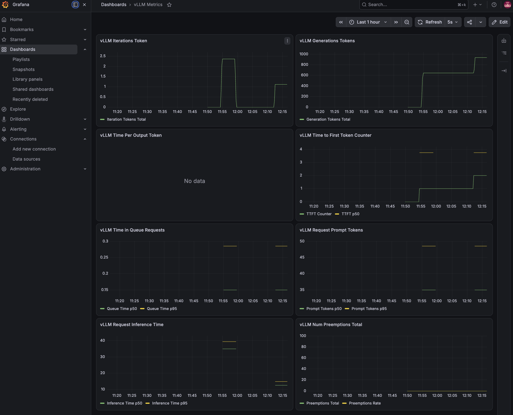

# Set up vLLM and a weather agent with Google's adk 

## Set up vLLM on M4 Max GPU
1. Set up steps for vLLM installationa on MAC M4 Max GPU

```> python3 -c "import platform; print(platform.machine())"```

```arm-64```

2. download and execute the Official metal installer
   
```> curl -fsSL https://raw.githubusercontent.com/vllm-project/vllm-metal/main/install.sh | bash```

4. Activate the environment

```> source ~/.venv-vllm-metal/bin/activate```

4. Confirm MLX sees your M4 Max GPU

```> python -c "import mlx.core as mx; print(f'MLX default hardware device: {mx.default_device()}')"```

```Output should be: MLX default hardware device: Device(gpu, 0)```

5. Check where is the model saved with its size
   
```> du -sh ~/.cache/huggingface/hub/*```

7. Run the model
   
```> vllm serve Qwen/Qwen2.5-7B-Instruct --port 8000```

Here ```--enable-auto-tool-choice ``` tells your local vLLM instance that it is allowed to accept incoming requests using OpenAI's structured "tool_choice": "auto" format.

```--tool-call-parser hermes``` tells vLLM to use the Hermes parser template, which is the exact tool layout Qwen 2.5 was natively trained on to output function parameters safely without formatting bugs.

```> vllm serve Qwen/Qwen2.5-7B-Instruct --port 8000 --enable-auto-tool-choice --tool-call-parser hermes ```

7. Run your test script

```> python vLLM_test.py```

## weather agent with Google's adk 
1. Install the core Google ADK framework

```> pip install google-adk```

2. Scaffold a clean agent project
   
```> adk create weather_agent```

```> cd weather_agent```

This creates a standardized project structure including a critical configuration setup and an ```agent.py``` template file. Write the weather app code in ```agent.py```. Register your agent 
```__init.py__``` file. 

3. Run your agent (Chat in the terminal)

```> adk run weather_agent```

4. Run your agent (Web UI Cockpit)

```> adk web --port 8080```

Open  browser and navigate to ```http://localhost:8080```. This loads the visual testing playground where you can select your agent, track execution logic, and view real-time token performance metadata.

# Set up observability locally without docker 

 1. Install Prometheus and Grafana binaries

``` > brew update```

``` > brew install prometheus grafana```

2. Configure the Native Prometheus Engine

```> nano /opt/homebrew/etc/prometheus.yml ```

In prometheus.yml - 
```
global:
  scrape_interval: 5s # Check vLLM stats every 5 seconds

scrape_configs:
  - job_name: 'vllm-local-inference'
    metrics_path: '/metrics'
    static_configs:
      - targets: ['localhost:8000'] # Points straight to your local vLLM port
```

3. Launch infrastructure services - start prometheus and grafana 

``` > brew services start prometheus```

``` > brew services start grafana ```

4. Run vLLM and verify data pipelines 

``` > source ~/.venv-vllm-metal/bin/activate```

``` > vllm serve Qwen/Qwen2.5-7B-Instruct --port 8000 ```

Confirm prometheus is running by navigating to ```http://localhost:9090```. 

In Status -> Targets, ```vllm-local-inference``` job listed with a green status badge labeled UP.

5. Map the live dashboard in Grafana 

Open local Grafana client web server: 
```http://localhost:3000``` and use default admin credentials: user - ```admin``` and password - ```admin```. 

Go to **Connections-> Data Sources -> Add data source**, and select Prometheus. 


Set the Connection URL box to point to your bare-metal port: ```http://localhost:9090``` and click Save & Test.

Finally, navigate to **Dashboards -> New -> Import**, type the official vLLM layout signature ID ```25263```, click Load, select your Prometheus pipeline from the option picker, and select Import.

